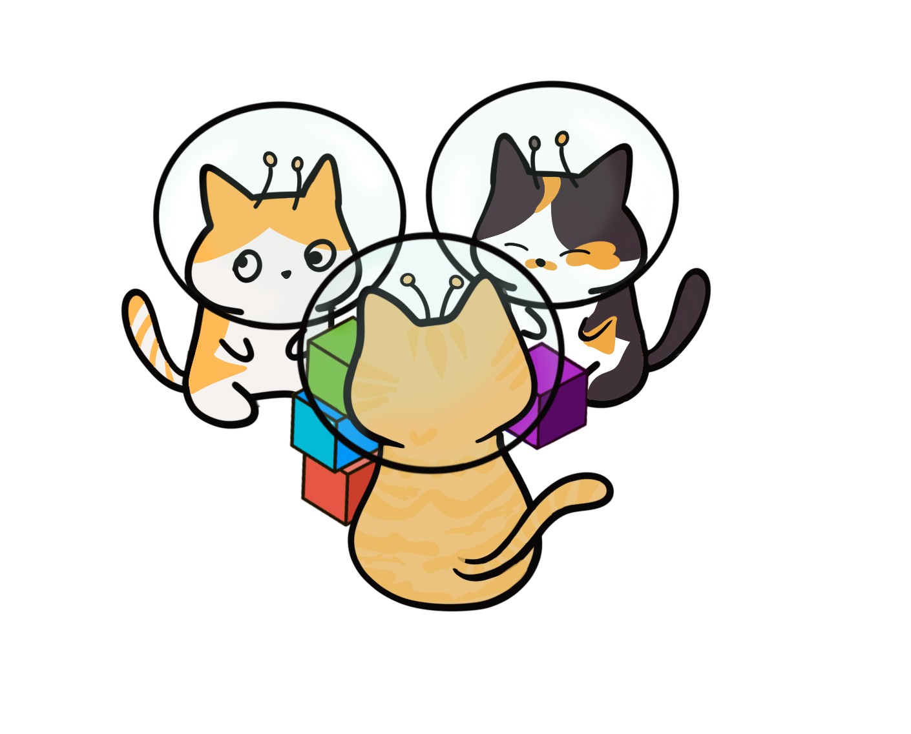

# rst

Package rst implements a reStructuredText parser. Refer to the
[reStructuredText Primer](https://docutils.sourceforge.io/docs/user/rst/quickref.html)
and [reStructuredText Markup Specification](https://docutils.sourceforge.io/docs/ref/rst/restructuredtext.html)
documents to implement the parser.

Work in progress.

## Tests

[docutils unit tests](https://repo.or.cz/docutils.git/tree/HEAD:/docutils/test/test_parsers/test_rst)
test the parser.

## reStructuredCats

The rst mascots, Cheese, Butters, and Scoop, watch over the project and were
designed by Dasol Dargan. The [cat images](doc/images) are Creative Commons
Attribution 4.0 licensed, which means you can use them but must provide credit
to their creator.
